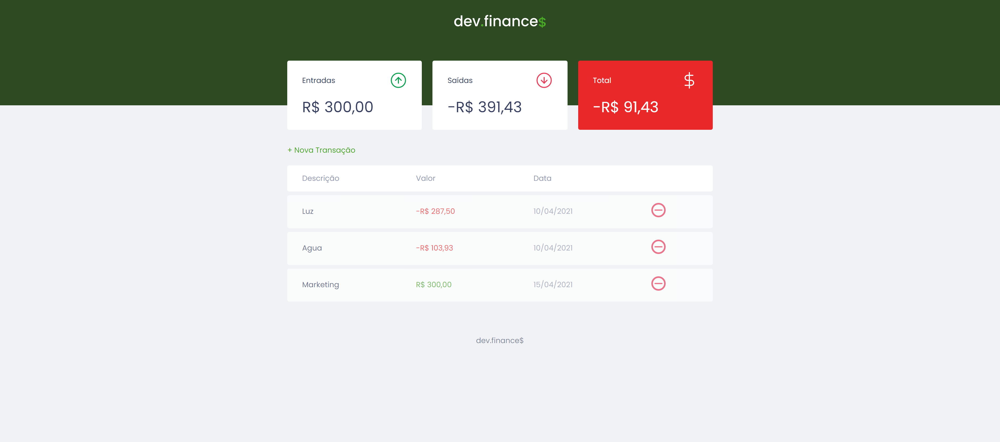
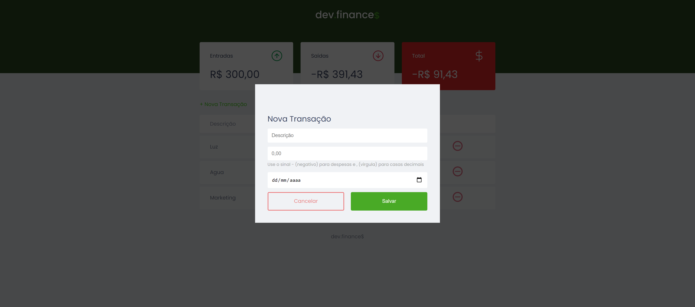
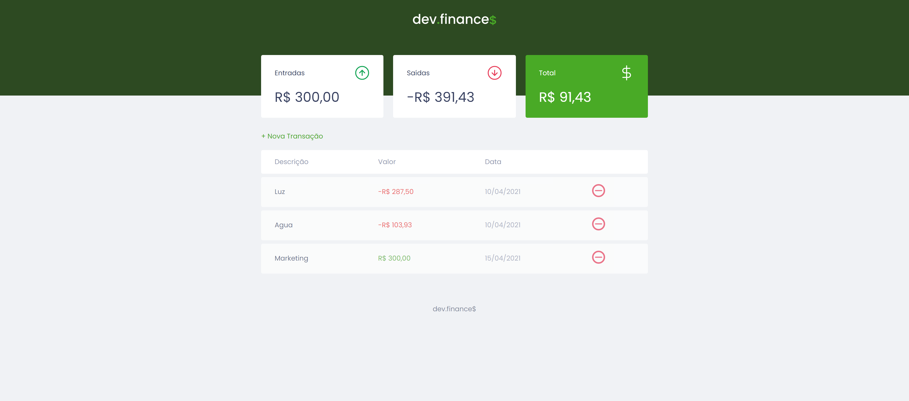

<h1 align="center">
  
</h1>

    
Projeto desenvolvido durante a maratona na Rocketseat usando HTML, CSS e JavaScript

    
Dev Finance é aplicação para controle de gastos de simples e organizada.

    
Projeto inicial com funções básicas de adicionar e remover transações

    
A evolução desse projeto sera feita em repositorios separados, usando os conhecimentos de React e Node para uma aplicação com banco de dados

 
<h3 align="center">Desktop</h3>

  

<h3 align="center">Modal</h3>

  

<h3 align="center">Total positivo</h3>

  

<h3 align="center">Total Negativo</h3>

  

## 🚀 Tecnologias

Esse projeto foi desenvolvido com as seguintes tecnologias:

- HTML
- CSS
- JavaScript

## 💻 Projeto

Dev Finance é aplicação para controle de gastos, entradas e saidas 💰.